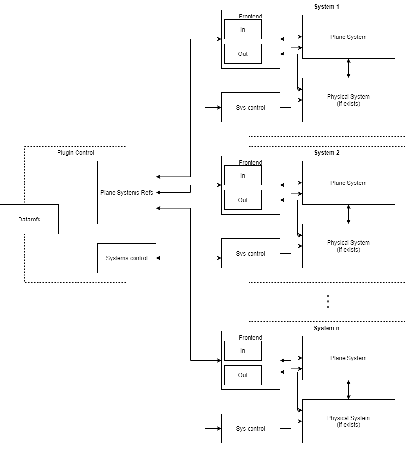

# J-Pro's A380 Systems

This repository is the home for all the C and C++ code that simulates in depth all the J-Pro's A380. 

If you are looking for the plane itself to try it or contribute to the display system, modeling or texturing, check out the plane repository: https://github.com/JproSimulations/a380

It is assumed that if you are to contribute to this repository, you have some experience with C or C++ and with github. If not, or if you want to learn more, be sure to come by our [Discord](https://discord.gg/nQZTXMT) where there is someone that will gladly guide you in your first steps!

The goal of this project is to create an as accurate as possible A380, so, all the code behind this plane is to be done according to the available documentation and information, which you can find in our [Drive](https://google.com)

## Contributing

This A380 is an open source project. So, everyone can and is welcome to contribute, being it by writing new code for new features, improving existing code, writing documentation, or even by just be creating or commenting issues with some information that may be useful!

If you want to contribute, you can search for open issues that are not assigned to someone, assign it to yourself and start working by forking this repository. Then, after solving the issue, you just have to make a pull request that will be reviewed by the core devs so that your code is integrated in the master branch code.

More detailed instructions can be found in [Contributing rules](./contrib.md).

## Architecture
The A380's systems are organized in a modular way, where each module represents one system. There is a module that is responsible for orchestrating the whole plugin and making sure every system has a way to read data from other systems.

The diagram bellow illustrates this organization.

All systems have three main components: 
1. The physical system, that represents the simulation of actual plane parts (like the fuel tanks, fuel pumps, etc);
2. The plane system, that simulates the plane's computers logic (like the FQMS for the fuel system);
3. The control part, that is comprised of two classes:
    1. The SystemControl, that is responsible to start the system and update (recalculate) it when triggered;
    2. The FrontEnd, that is the communication endpoint of each system. This also is used as a cache so that if we need to implement multithreading in the future, we have single points of concurrent accesses.

Each system can have a readme and extra files documenting specific aspects of itself.

There is also a Documents folder that has extra information about systems or coding details!

## Code style
All the code is mainly C code just with the addition of C++ classes. This was done to keep tighter control of memory allocation (using mallocs) to try to improve performance. (It was also done because the head developer is more familiar with C than C++ )

The main effort to increase performance is to ensure all classes' initializations and memory allocations are done in the plugin enable phase and never in the update phases that occur several times a second. This may lead to a bigger memory footprint, however we feel that is acceptable in exchange for performance.

IMPORTANT: Make sure any new files you create, remove or change the name are correctly inserted or removed from the CMakeLists.txt file!

## Build
There are several ways to compile the code in this repository, depending on your OS and the target OS for the build.
### All systems (universal)
This method works in all OSs and builds the plugin for all three OSs (win, mac, lin). This method uses a linux docker image and some scripts to avoid installing several compilers and tools in you system.
To use this method you only have to have installed [Docker](https://docs.docker.com/install/) and GNU Make (there is a version for windows too!).

Just go to the `docker` directory:

    $ cd docker
    
And run the `make` command:

    $ make
    
After the completion of the command, you will have three directories in the `src` directory:
1. src/build-lin/lin.xpl
2. src/build-mac/mac.xpl
3. src/build-win/win.xpl

That have the three plugin files for the three OSs. You can then copy them to the plugin folder of the plane, according to the default structure of a fat plugin.

### Windows -> Windows
This method works to compile this plugin in Windows, using Windows as the target.

To use this method you have to have installed [CMake](https://cmake.org/download/) and [MinGW](http://www.mingw.org/).

To build using this method, you just have to go to the `src` folder and run `cmake`:

    $ cd src
    $ cmake
    
This will create a directory called `cmake-build-release`. In that directory you will find the file `A380Systems.xpl`, this is the plugin file you will need to place in the plane plugins folder, substituting the one that is already there.

### Other methods
For now these are the only supported and tested methods. You can always add new methods (or improve the current ones) by submitting a pull request!

## Licence
All the code and text in this repository is licensed under the GNU General Public License version 3.

## Acknowledgements 
We thank all contributors to this project for all the contributions!

The credit for the build system using docker goes for https://github.com/sparker256.
